# Xenflow

Xenium spatial transcriptomics analysis pipeline built with Nextflow and Singularity/Apptainer. The pipeline uses cv2 to automatically identify tissue contours and bounding boxes, making it especially suited for tissue microarrays and multi-sample slides.

## Quick start
1. Build a container `sopa.sif` using the definition file from [this repository](https://github.com/tsvvas/singularity_defs).
2. Export two environment variables:
- `CONTAINERDIR` → path to the container image.
- `PROJECTDIR` → path to the project directory (mounted inside the container at runtime).
3. Adjust resource settings in [resources.config](config/resources.config) for each pipeline step.
4. Create a run-specific config (e.g., run01.config) in the config directory, based on [run.template](config/run.template).
5. Create an environment with Nextflow installed using `make env_create`.
6. Run the pipeline using `make nf_run`.

## Key steps
The workflow processes raw Xenium output through to the identification of gene programs with [cNMF](https://github.com/dylkot/cNMF).

- CONVERT_XENIUM converts raw data to [spatialdata](https://github.com/scverse/spatialdata)-formatted zarr archive for downstream processing.
- RESEGMENT_NUCLEI applies [cellpose](https://github.com/MouseLand/cellpose) or [stardist](https://github.com/stardist/stardist) to resegment nuclei.
- RESEGMENT_CELLS applies [Baysor](https://github.com/kharchenkolab/Baysor) or [Proseg](https://github.com/dcjones/proseg) to refine segmentation based on transcript distributions.
- DETECT_TISSUE identifies tissue contours and bounding boxes, splitting multi-sample slides into independent samples (especially useful for tissue microarrays).
- SPLIT_SAMPLES creates one AnnData h5ad archive per sample based on the tissue contours.
- IDENTIFY_PROGRAMS runs cNMF on each sample. Note: The pipeline does not automatically select the optimal number of programs, this step is left to the user.
